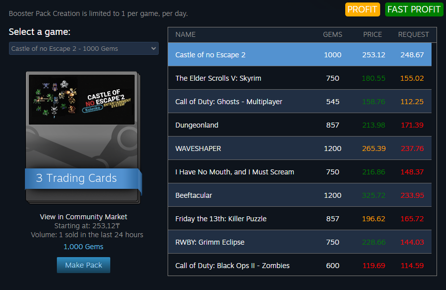

# Steam Booster Packs Profit Finder

Fork of [Steam Booster Packs Profit Finder v2.1.5](https://chromewebstore.google.com/detail/steam-booster-packs-profi/knhicbficbafeombbgjfenfjfngmnann) by [@16ROCK](https://github.com/16ROCK)

## Colors

- Green: If the item's gem value is at least 13.04% cheaper than its price.
- Orange: If the item's gem value is less than the price but not 13.04% cheaper.
- Red: If the item's gem value is equal to or greater than the price.

## Installation

1. Install any recommended userscript manager for your browser

   - [Violentmonkey](https://violentmonkey.github.io/)
   - [Tampermonkey](https://www.tampermonkey.net/)

2. Click [Install](https://github.com/xob0t/steam_booster_packs_profit_finder/raw/refs/heads/main/steam_booster_packs_profit_finder.user.js)
3. Accept installation
